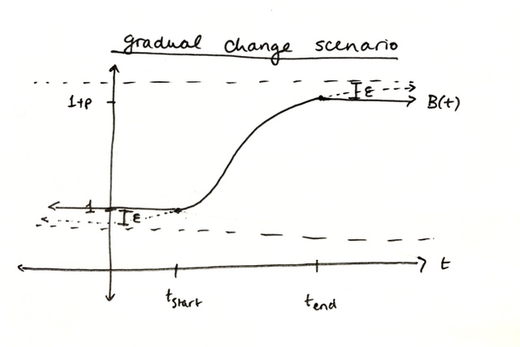

```{r, include = FALSE}
knitr::opts_chunk$set(
  collapse = TRUE,
  comment = "#>",
  fig.height = 6,
  fig.width = 6
)
```

```{r setup, echo = FALSE}
library(reemscenex)
```

Several simulation scenarios are available in `reemscenex`. They build off of the setup of the Renewal Equation Epidemic Model (REEM), as encoded in the [`reem` package](https://github.com/phac-nml-phrsd/reem). Full documentation of the REEM model can be found [here](https://github.com/phac-nml-phrsd/reem/blob/main/doc/reem-model.pdf) but we describe it briefly below, with a view to explain how forecast scenarios are constructed for `reemscenex`.

# REEM model overview

The REEM model uses the [renewal equation](https://epubs.siam.org/doi/pdf/10.1137/18M1186411) as a foundation to model disease incidence, $i_t$, at every time step, $t$. It also tracks the total number of susceptibles, $S_t$, in order to update incidence at each point in time. This version of the model additionally incorporates information from the wastewater concentration over time, $w_t$, and daily hospital admissions, $h_t$. The equations are:

$$
i_t =\left(\frac{S_{t-1}}{N} \right)^{e^{\alpha}} B(t)\mathcal{R}_0 \sum_{0<k<G}g(k)i(t-k) \\
S_t =\max(S_{t-1} -i_t,0)  \\
w_t =w_{\rm mult}\sum_{0<k<L}f(k)i(t-k) \\
h_t =h_{\rm prop} \sum_{0<k<A}a(k)i(t-k)
$$

where

- $N$: population size
- $\alpha$: contact heterogeneity parameter, with $\alpha=0$ corresponding to homogeneous mixing
- $B(t)$: a (time-varying) transmissibility factor
- $\mathcal{R}_0$ : basic reproduction number
- $g$: discrete intrinsic generation interval distribution, as a function of the time between sequential infections in days, up to a maximum of $G$ considered
- $w_{\rm mult}$: fecal shedding multiplier that scales each incident infection to an average amount of viral particles shed in wastewater, in units of concentration (assumed constant over time)
- $f$: discrete fecal shedding distribution in days, up to a maximum of $L$ days considered
- $h_{\rm prop}$: proportion of infections that are hospitalized (assumed constant over time)
- $a$: discrete hospital admission delay distribution in days, up to a maximum of $A$ days considered

(This notation is slightly different from the one found in [`{reem}` package documentation](https://github.com/phac-nml-phrsd/reem).)

The REEM model is fitted to weekly clinical reports, daily wastewater concentration, and daily hospital admissions using Bayesian methods, which start with priors on each parameter and result in a posterior distributions. The fitted parameters are:

- $\mathcal{R}_0$, the basic reproduction number,
- $\alpha$, the heterogeneity parameters,
- $i_0$, the initial number of infectious individuals,
- the start date of the latest epidemic wave,
- $w_{\rm mult}$, the fecal shedding multiplier,
- $h_{\rm prop}$, the hospitalization proportion.

Note that, during fitting, $B(t)$ is set to 1 for all time, so that model parameters are fitted in a neutral state.

To construct forecast scenarios, we take a fitted REEM model and impose additional assumptions on up to one parameter (currently): $B(t)$, the transmissibility factor, used to encode exogenous, hypothetical effects on transmission that are not captured by the fit. 

Since $B$ is a transmission multiplier, all of its values should be non-negative, where values **below 1** represent **transmission decreases** and values **above 1** represent **transmission increases**. For instance, a  value of 1.2 would indicate a 20% increase in transmission (relative to the level of transmission encoded in the fitted parameters).

# Available scenarios

Scenarios are set up with the `sc()` function, which always takes a named scenario options list (`opts`) that must at least include a scenario name entry (`name`), as well as any scenario-specific inputs.

## Sudden change in transmission due to population activity

A sudden change in transmission is simulated by increasing $B$ on a specified date, `date`, to a specified target value, `value`. Parameters for this scenario can be generated as follows:

```{r sudden-change}
sc(
  model = model.example,
  opts = list(
    name = "sudden change in transmission", 
    start.date = "2022-04-01",
    value = 1.2
  )
)
```

The above would implement a scenario where transmission increases by 20% from 1 Apr 2022 onward.

## Gradual change in transmission due to population activity

A gradual change in transmission is simulated by increasing $B$ on a specified start date, `start.date`, until a specified end date, `end.date`, to a specified multiplier, `value`. Parameters for this scenario can be generated as follows:

```{r gradual-change}
sc(
  model = model.example, 
  opts = list(
    name = "gradual change in transmission",
    start.date = as.Date("2022-02-12"),
    end.date = as.Date("2022-02-15"),
    value = 2
  )
)
```

The gradual change model is implemented as a piecewise logistic function:

$$
B(t) = 1 + 
\begin{cases} 
      0 & \text{for } t \leq t_{\rm start} \\
      p\frac{(e^{r(t-t_{\rm start})}-1)}{(1+e^{r(t-t_{\rm start}-\delta)}  )(e^{r\delta}-1)} & \text{for } t_{\rm start} < t < t_{\rm end} \\
      p & \text{for } t \geq t_{\rm end}
   \end{cases}
$$

where

- $t_{\rm start}$ and $t_{\rm end}$ are `start.date` and `end.date`, respectively
- $\delta$ is half the time interval between `start.date` and `end.date`, _i.e._ $\delta = (t_{\rm end} - t_{\rm start})/2$
- $p$ is 1-`value` (so that $B(t) =$ `value` $= 1 + p$ on and after `end.date`)
- $r$ is calculated as $1/\delta \log(p/\varepsilon + 1)$, where $\varepsilon>0$ is the vertical distance between the extrema of this piecewise logistic and the asymptotes of the unconstrained logistic.

The last point is best understood with a visual:




```{r}
#| eval: false
#| echo: false

# TODO: Adapt a subset of the code below to replace the sketch for gradual change above

# Plot all scenario helper functions ----
{
  curve(reemscenex:::sudden_change(1, x), from = -1, to = 6, col = 1, yaxt = "n", ylim = c(0, 3), ylab = "B(t)", xlab = "Time in days", main = "B(t) Function - Temporal Change in Transmission")
  curve(reemscenex:::gradual_change(5, 1/4, 1, x), from = -1, to = 6, col = 3, add = TRUE)
  curve(reemscenex:::invasion_change(5, 1/4, 1, 2, x), from = -1, to = 6, col = 4, add = TRUE)
  axis(2, at = 0:3)
  legend("bottomright", legend = c(expression(paste("Sudden Change")), expression(paste("Gradual Change")), expression(paste("Invasion Change"))),
         col = c(1, 2, 3, 4), lty = 1, lwd = 2)
}

# Data Frame Creation ----
# Create a data frame for all days and B(t) values per different scenario
t <- c(-1:10)
B_t <- cbind(t, reemscenex:::sudden_change(1, t), reemscenex:::gradual_change(5, 1/4, 1, t), reemscenex:::invasion_change(5, 1/4, 1, 2, t))
colnames(B_t) <- c("day", "Sudden Change B(t)", "Gradual Change B(t)", "Invasion Change B(t)")
```

$\varepsilon$ can optionally be specified in the scenario parameters as `epsilon`. The closer to zero $\varepsilon$ is, the more shapely the logistic segment of this function. Left unspecified, $\varepsilon$ adopts a sensible default (very small).

# For developers 

If you will be developing scenario pre-specified scenarios for the package, please review the following.

## Formatting B(t) for compatibility with `reem`

There are a few things to keep in mind when developing new scenario functions for $B(t)$. 

As of `reem` v0.8.2, `B` is specified as a data frame with the columns `date` and `mult`, specifying the value of $B$ (`mult`) to use on each `date`. If we know the simulation dates, `B` is easy to build: simply make a data frame whose `date` column has a date for each day between the simulation start and end dates (inclusive), with `mult` = 1 on each of these days and then only update the value of `mult` on days where you want `B` to be non-zero. For a simple simulation, the simulation dates can be retrieved from the model object: the start date is simply `prms$date.start` and the end date is `prms$date.start + prms$horizon`.

However, these dates can change during the fitting and forecasting process. For instance, the start date can vary during a fit if `prms$start.delta` is specified and is a fitting parameter, which it often is in practice as it is usually to restrictive to specify a single start date for all iterations of the fit. When forecasting, the simulation end date can also change from the one used for the fit according to `fcst.prm$horizon.fcst`. In these cases, it is impossible to pre-specify a single set of start and end dates to use for simulation, and therefore we cannot generate `B` as described above.

Instead, we can use some information about how `reem` handles `B` when simulating to cleverly create `B` for many scenarios that we want. There are a few cases for overlap between the simulation date range and the date range given in `B`. We list them here and describe `reem`'s behaviour:

- **Full overlap**: `B`'s date range fully encompasses the simulation date range 
  - `reem` ignores `B` dates outside of the simulation date range, no harm no foul!
- **Partial overlap**: `B`'s first (and/or last) date is after (before) the simulation start (end) date 
  - Here, `B` values aren't specified for part of the simulation date range. In this case, `reem` will impute `B` values based on what it knows and throw a warning telling the user exactly what it did. 
  - If the first `date` in `B` is after the simulation start date, `reem` will repeat `B$mult[1]` for all dates between the simulation start date and the first date in `B`. (I don't think `reem` does any sorting of `B`, so it's important to pass `B` in chronological order!)
  - If the last `date` in `B` is after the simulation end date, `reem` will repeat `B$mult[n]` for all dates between the last `B` date and the simulation end date, where `n` is the number of rows in `B`.
